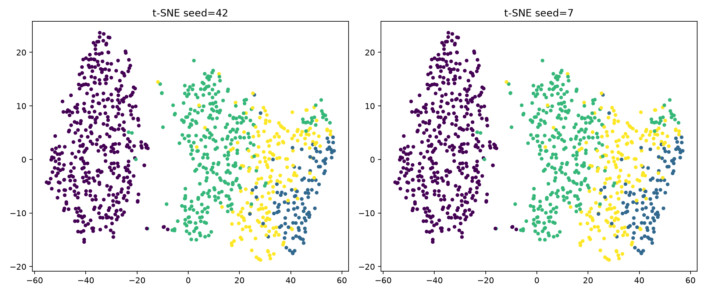
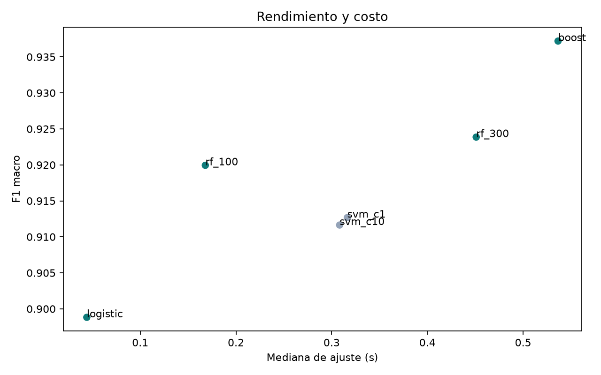

# INF8239_U01 — LAB03 · Ensambles, reducción dimensional y Green AI

Laboratorio de Ciencia de Datos II (Ejercicio 02). Amplía el problema del LAB02
(clasificación de calidad del aire) comparando **SVM, Random Forest y boosting** bajo un
mismo protocolo, aplicando **PCA** y **t-SNE**, y decidiendo un modelo mediante la
**frontera de Pareto** (equilibrio desempeño–costo, Green AI).

- **Dataset:** *Air Quality and Pollution Assessment* (Kaggle · Apache 2.0), reutilizado
  del LAB02. Target `Air Quality` (4 clases). **Métrica:** F1 macro. **Clase
  prioritaria:** Hazardous.

> ⚠️ Ejercicio académico. Los tiempos medidos son **contextuales al hardware** y **no**
> representan consumo energético exacto.

---

## Estructura (archivos del LAB03)

```
INF8239_U01/
├── notebooks/
│   └── 03_ensambles_green_ai.ipynb   # notebook principal del LAB03
├── src/inf8239_u01/
│   └── green.py                       # pareto_flags(): frontera de Pareto
├── tests/
│   └── test_green.py                  # 2 pruebas de la frontera de Pareto
├── reports/
│   ├── green_ai_results.csv           # catálogo con métricas y costos
│   ├── tsne_two_seeds.png             # dos proyecciones t-SNE
│   ├── pareto.png                     # frontera de Pareto (F1 vs. tiempo)
│   └── models/                        # modelos serializados (.joblib, no versionados)
├── requirements.txt
└── README.md
```

---

## Requisitos y reproducción

```bash
source .venv/Scripts/activate        # Git Bash (Windows)
pip install -r requirements.txt
```

Reutiliza el dataset descargado en el LAB02 (`data/raw/dataset.csv`). Ejecuta
`notebooks/03_ensambles_green_ai.ipynb` de inicio a fin. El experimento es determinista
(`random_state=42`): la partición es idéntica a la del LAB02, lo que **congela el
protocolo**.

---

## Metodología (componentes del experimento)

- **Familias de modelos comparadas:** **SVM** (`svm_c1`, `svm_c10`), **Random Forest /
  bagging** (`rf_100`, `rf_300`) y **boosting** (`boost`, HistGradientBoosting), más una
  regresión logística de contraste — 6 configuraciones en total.
- **Reducción dimensional — PCA:** se compara la SVM **con y sin** PCA
  (`n_components=0.95`), reportando componentes retenidos y varianza acumulada.
- **Reducción dimensional — t-SNE:** **dos proyecciones con semillas distintas (42 y 7)**
  para distinguir la estructura estable del ruido aleatorio.
- **Medición temporal:** cada modelo se ajusta **tres veces** y se reporta la **mediana**
  del tiempo (`fit_median_s`), reduciendo el ruido de medición.
- **Costo de despliegue:** se registra el **tamaño serializado** de cada modelo en disco
  (`size_kb`, vía `joblib`) y el **tiempo de inferencia** sobre la prueba (`predict_ms`).

---

## Catálogo y resultados

Seis configuraciones evaluadas sobre la misma prueba (valores reales; los tiempos
dependen del hardware):

| Modelo | F1 macro | Recall macro | Ajuste mediana (s) | Inferencia (ms) | Tamaño (kb) | Pareto |
|--------|----------|--------------|--------------------|-----------------|-------------|--------|
| boost | **0.9389** | 0.9350 | 0.574 | 16.6 | 1217.9 | ✅ |
| rf_300 | 0.9239 | 0.9154 | 1.018 | 89.1 | 4922.6 | ❌ |
| rf_100 | 0.9199 | 0.9117 | 0.383 | 38.4 | 1661.0 | ✅ |
| svm_c1 | 0.9127 | 0.9079 | 0.356 | 30.8 | 111.9 | ✅ |
| svm_c10 | 0.9116 | 0.9079 | 0.358 | 26.2 | 92.4 | ❌ |
| logistic | 0.8988 | 0.8906 | 0.039 | 2.9 | 4.0 | ✅ |

(Columnas: `Ajuste mediana` = mediana de 3 repeticiones; `Inferencia` y `Tamaño` = costo
de despliegue.)

---

## Reducción dimensional

**PCA (95% de varianza):** conserva **7 de 9** componentes (varianza acumulada
**97.35%**). F1 macro: **0.9127 sin PCA** vs **0.9072 con PCA**. PCA no aporta aquí,
porque el dataset ya es de baja dimensión.

**t-SNE (semillas 42 y 7):**



La clase **Good** se separa con claridad; **Moderate, Poor y Hazardous** se solapan en un
continuo. La estructura se mantiene entre semillas; solo cambian orientaciones locales.
La separación visual no valida por sí sola un clasificador.

---

## Frontera de Pareto y decisión Green AI



El máximo desempeño es **boost** (F1 0.9389, mejor recall 0.9350, menor inferencia
16.6 ms). Como alternativa económica se evalúa **svm_c1** (F1 0.9127):

- Diferencia absoluta de F1: **0.0262** (2.6 puntos).
- Ahorro de tiempo de ajuste: **~38%** (0.574 s → 0.356 s).
- Reducción de tamaño: **~91%** (1217.9 kb → 111.9 kb).

Dado que la clase prioritaria es Hazardous y boost tiene mejor recall e inferencia más
rápida, **se recomienda boost** para un sistema de alertas; svm_c1 (o logistic) es la
opción Green AI si el reentrenamiento frecuente o la memoria limitada pesan más que 2.6
puntos de F1. La justificación completa (300–500 palabras) está en el notebook.

---

## Pruebas

```bash
PYTHONPATH=src python -m pytest -q
```

`tests/test_green.py` verifica `pareto_flags`: marca correctamente las filas dominadas y
que un único modelo siempre pertenece a la frontera.

---

## Registro del entorno

El notebook imprime Python, sistema operativo, procesador y versión de scikit-learn, que
son el **contexto de los tiempos** reportados. Los tiempos no equivalen a consumo
energético; una medición rigurosa requeriría una herramienta específica (p. ej.
CodeCarbon) declarando región y supuestos.

---

## 10. Entrega y verificación (Ejercicio 02)

| # | Criterio | Estado | Evidencia |
|---|----------|--------|-----------|
| 1 | Mismo dataset y partición del Ejercicio 01 | ✅ | Protocolo congelado; `train_test_split(test_size=0.20, random_state=42, stratify=y)` idéntico al LAB02 |
| 2 | Al menos seis configuraciones | ✅ | 6 modelos: logistic, svm_c1, svm_c10, rf_100, rf_300, boost |
| 3 | SVM, Random Forest y boosting | ✅ | Sección *Metodología* + catálogo (las tres familias) |
| 4 | PCA o alternativa justificada | ✅ | Sección *Reducción dimensional*: PCA 95% → 7 de 9 comp. (97.35% var.), F1 0.9127 → 0.9072 |
| 5 | Dos t-SNE con semillas distintas | ✅ | Sección *Reducción dimensional*: semillas 42 y 7 → `reports/tsne_two_seeds.png` |
| 6 | Tres repeticiones temporales y mediana | ✅ | Columna `Ajuste mediana (s)` (mediana de 3 repeticiones) |
| 7 | Tamaño serializado e inferencia | ✅ | Columnas `Tamaño (kb)` y `Inferencia (ms)` del catálogo |
| 8 | CSV, figuras, pruebas y README | ✅ | `green_ai_results.csv`, `tsne_two_seeds.png`, `pareto.png`, `test_green.py`, este README |
| 9 | Frontera de Pareto y decisión cuantificada | ✅ | `is_pareto` en el CSV + decisión de 300–500 palabras en el notebook |

