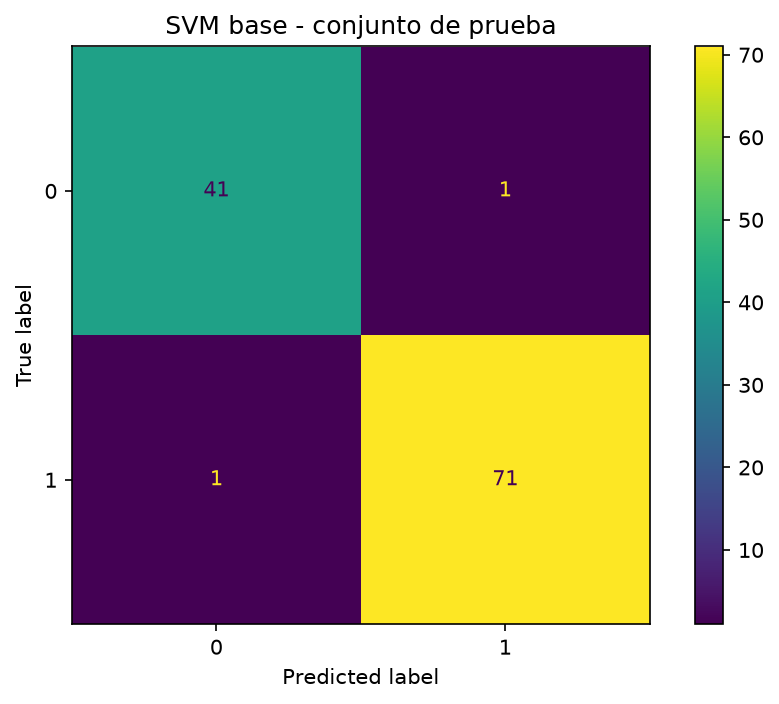

# INF8239_U01 — LAB01 · SVM con pipeline, búsqueda de parámetros y evaluación

Laboratorio guiado de Ciencia de Datos II. Construye una línea base y una **Máquina de
Vectores de Soporte (SVM)** sin fuga de información, compara los hiperparámetros `C` y
`gamma` mediante validación cruzada, e interpreta los errores del modelo sobre el
dataset *Breast Cancer Wisconsin (Diagnostic)*.

> ⚠️ **Advertencia:** Ejercicio exclusivamente **académico**. Los resultados **no
> constituyen un diagnóstico médico** ni deben usarse para decisiones clínicas.

---

## Estructura (archivos del LAB01)

```
INF8239_U01/
├── notebooks/
│   └── 01_svm_guiada.ipynb     # notebook principal del LAB01
├── src/inf8239_u01/
│   └── models.py               # build_svm(): pipeline reutilizable
├── tests/
│   └── test_models.py          # 3 pruebas del modelo
├── reports/
│   ├── svm_cv_results.csv       # resultados de validación cruzada
│   └── svm_best.joblib          # mejor modelo serializado
├── images/
│   └── confusion_matrix.png     # matriz de confusión (SVM base)
├── requirements.txt
└── README.md
```

---

## Requisitos

- **Python 3.10+**
- Dependencias en `requirements.txt` (`pandas`, `scikit-learn`, `matplotlib`,
  `joblib`, `jupyter`/`ipykernel`, `pytest`).

El dataset **no requiere descarga**: se carga directamente desde
`sklearn.datasets.load_breast_cancer`.

---

## Instalación

```bash
python -m venv .venv
source .venv/Scripts/activate      # Git Bash (Windows). PowerShell: .\.venv\Scripts\Activate.ps1
python -m pip install --upgrade pip
pip install -r requirements.txt
```

---

## Target y métrica

- **Target:** diagnóstico binario — `0 = maligno`, `1 = benigno`.
- **Métrica principal:** **F1 macro** (igual peso a ambas clases), acompañada de
  **ROC-AUC** y la matriz de confusión.
- **Error más costoso:** clasificar un tumor **maligno como benigno** (falso negativo
  clínico): retrasa el tratamiento y pone en riesgo al paciente.

---

## Cómo reproducir

1. Activa el entorno virtual e instala dependencias.
2. Selecciona el kernel `.venv` en el notebook.
3. Ejecuta `notebooks/01_svm_guiada.ipynb` de inicio a fin.

El experimento es **determinista** (`random_state=42` en división, modelo y CV).

---

## Código reutilizable

La construcción del modelo se centraliza en `src/inf8239_u01/models.py`:

```python
from inf8239_u01.models import build_svm
model = build_svm(C=1.0, gamma="scale")   # Pipeline: StandardScaler + SVC(rbf)
```

El escalado va **dentro del Pipeline**, evitando *data leakage*.

---

## Pruebas

```bash
PYTHONPATH=src python -m pytest -q       # Git Bash
# PowerShell: $env:PYTHONPATH="src"; python -m pytest -q
```

`tests/test_models.py` incluye 3 pruebas: una predicción por fila, rechazo de `C<=0` y
que el pipeline contenga los pasos `scale` y `model`. Resultado esperado: todas en verde.

---

## Resultados

| Modelo | F1 macro (prueba) |
|--------|-------------------|
| Baseline (DummyClassifier) | 0.3871 |
| SVM base (RBF, C=1) | 0.9812 |
| SVM optimizado (C=10, gamma=0.01) | 0.9812 |

**SVM base sobre el conjunto de prueba:** accuracy **0.9825**, ROC-AUC **0.995**.

**Búsqueda de hiperparámetros (GridSearchCV, 5 folds):** mejor combinación
`C=10, gamma=0.01` con F1 macro en validación de **0.9739** (desviación baja, ~0.018).

**Matriz de confusión (SVM base):** solo **2 errores de 114 casos** — 1 tumor maligno
clasificado como benigno y 1 benigno clasificado como maligno. El primero es el error
clínicamente más grave, por lo que se vigila el **recall de la clase maligna**.

---

## Visualización



---

## Conclusión

El SVM superó ampliamente la línea base (F1 macro 0.9812 frente a 0.3871), confirmando
que aprende patrones reales a partir de las 30 características morfológicas. El escalado
encapsulado en el Pipeline y la búsqueda de `C`/`gamma` mediante validación cruzada
estratificada garantizaron una evaluación sin fuga de información. El modelo optimizado
igualó el desempeño del base (F1 macro 0.9812), lo que indica que la configuración
inicial ya era muy sólida para un problema bien separable. El análisis de la matriz de
confusión, con un único falso negativo clínico, refuerza que la métrica y el recall de
la clase maligna —no la exactitud global— son los criterios correctos para juzgar el
modelo. La reproducibilidad quedó asegurada con semilla fija, pruebas automatizadas y
artefactos versionados.